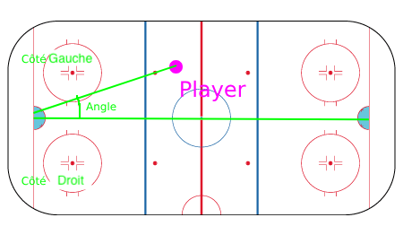

# Notes taken during the project

## 1. Data fetching

### API Documentation

The [documentation linked](https://gitlab.com/dword4/nhlapi/-/blob/master/stats-api.md#game-ids) in the instructions are deprecated.
The API endpoint is not available anymore.

I found the newest [version of the documentation](https://gitlab.com/dword4/nhlapi/-/blob/master/new-api.md).

[This one](https://github.com/Zmalski/NHL-API-Reference) is also helpful.

### Helpers

#### Game ID & Series Letter

Addition of a helper function `get_game_id` to compute the game Id from date, game type and game number.

Addition of a helper function `get_series_letter` to compute the series letter from the round and games indices.

### Enums

Use of enums to define the game types.

### Data fetching & cache

Creation of a ApiClient class to fetch data from the NHL API.
This class accepts a `Cache` instance in its constructor to store the fetched data.
This allows to avoid fetching the same data multiple times.
This also allows to download the whole data in multiple steps.

#### Cache engine

`Cache` is an abstract class that defines the interface for a cache.
It defines the following methods:

- `has`
- `get`
- `set`
- `remove`
- `clear`

Creation of `FileSystemCache` class to store the fetched data in a local file. It implements the `Cache` interface.

We could imagine other Cache systems like a `RedisCache`, a `InMemoryCache`, etc.
But for this project, the `FileSystemCache` is enough.

##### Improvement

Add method `fetch_from_url_and_cache` in `ApiClient` to avoid repetition of the same code.

### Endpoints

#### Usage of stats API to dynamically retrieve the game count in a season

Here is a sample response from `https://api.nhle.com/stats/rest/en/season`

```json
{
  "data": [
    {
      "id": 20232024,
      "allStarGameInUse": 1,
      "conferencesInUse": 1,
      "divisionsInUse": 1,
      "endDate": "2024-06-24T00:00:00",
      "entryDraftInUse": 1,
      "formattedSeasonId": "2023-24",
      "minimumPlayoffMinutesForGoalieStatsLeaders": 240,
      "minimumRegularGamesForGoalieStatsLeaders": 25,
      "nhlStanleyCupOwner": 1,
      "numberOfGames": 82,
      "olympicsParticipation": 0,
      "pointForOTLossInUse": 1,
      "preseasonStartdate": "2023-09-23T00:05:00",
      "regularSeasonEndDate": "2024-04-18T22:30:00",
      "rowInUse": 1,
      "seasonOrdinal": 106,
      "startDate": "2023-10-10T17:30:00",
      "supplementalDraftInUse": 0,
      "tiesInUse": 0,
      "totalPlayoffGames": 88,
      "totalRegularSeasonGames": 1312,
      "wildcardInUse": 1
    }
  ],
  "total": 107
}
```

#### Game data for a whole season

Creation of a method `get_games_data` in the `ApiClient` class to fetch the data for a whole season.
This stores every game data in the cache.

**Issue**: The game number `0001` for playoffs seems to be not found.
https://api-web.nhle.com/v1/gamecenter/2020030001/play-by-play returns a 404.

**Solution**: Response found in [the documentation](https://gitlab.com/dword4/nhlapi/-/blob/master/stats-api.md#game-ids): 

> For playoff games, the 2nd digit of the specific number gives the round of the playoffs,
> the 3rd digit specifies the matchup, and the 4th digit specifies the game (out of 7).

1. Found information in this endpoint: https://api-web.nhle.com/v1/playoff-bracket/2022
2. This endpoint has some issues, series letter are not always the same and the sum of the wins mismatch the game numbers.
3. Found a better endpoint: https://api-web.nhle.com/v1/playoff-series/carousel/20232024/


#### Usage of the Playoff carrousel API to dynamically retrieve the games count in a specific series

Finding the number of games in a series was not trivial. This can be from 4 to 7 games.

Based on [this endpoint](https://api-web.nhle.com/v1/playoff-series/carousel/20232024/) we can find this information.
First, in order to find the right series, we have to define the letter of hte series from the round and the series index.
Then,  we had to add the wins of each team to find the number of games played.
From this, we can find the number of games left to play.
We are now able to generate all the game numbers for playoffs.

### Raw data storage

At the end of the fetching process, the data is stored in the dump. One file per season.
A helper function `load_raw_games_data` is created to load the data from the dump (every or one season).

## 2. Data processing

### Convert raw data to a DataFrame

Add a helper class `DataTransformer` that flatten all games events and filter events of type `shot-on-goal` and `goal`.
It should be used with the `load_plays_dataframe` function.

Improvements:
- Add to team id of each player. 
- Avoid searching multiple times in the same nested object.

### Compute goal position

The side of the home team is calculated using the following steps:

1. **Guessing the Home Team Side for the First Period**:
   - The first relevant event is an event in the "plays" list that has `details.zoneCode` as 'O' (Offensive) or 'D' (Defensive).
   - Based on the `details` of this event (such as `xCoord`, `zoneCode`, `eventOwnerTeamId`, and `periodDescriptor.number`), the side of the home team is determined.
   - If the event is in the defensive zone ('D') for the home team, the side is determined by the `xCoord` value (left if `xCoord` < 0, right if `xCoord` > 0).
   - If the event is in the offensive zone ('O') for the home team, the side is determined by the `xCoord` value (left if `xCoord` > 0, right if `xCoord` < 0).
   - If the period is even, the side is inverted using the `invert_side` method.

2. **Determining the Home Team Side for Any Period**:
   - The `get_home_team_side_for_period` method is used to get the side of the home team for a given period.
   - If the period is even, the side is inverted using the `invert_side` method.
   - Otherwise, the side remains the same as determined for the first period.

This approach ensures that the side of the home team is dynamically calculated based on the game events and the period.

From this, we are able to get the adversary side and the goal position for each event.

Now we can compute the distance and the angle to the goal for each event.



#### Issue with the `blocked-shot` events

In case of a `blocked-shot` event, the `eventOwnerTeamId` is the team that initiated the shot, not the team that blocked it.
But the coordinates are the ones from the blocking player.
Therefore, it inverts the side of the home team.
We decided to consider only `shot-on-goal`, `missed-shot` and `goal` events to compute the home team side.

`blocked-shot` event example:

```json
{
   "eventId": 53,
   "periodDescriptor": {
     "number": 1,
     "periodType": "REG",
     "maxRegulationPeriods": 3
   },
   "timeInPeriod": "00:15",
   "timeRemaining": "19:45",
   "situationCode": "1551",
   "typeCode": 508,
   "typeDescKey": "blocked-shot",
   "sortOrder": 7,
   "details": {
     "xCoord": -75,
     "yCoord": 9,
     "zoneCode": "D",
     "blockingPlayerId": 8475233,
     "shootingPlayerId": 8474027,
     "eventOwnerTeamId": 28
   }
}
```

#### Issue with the goal position

Some events may have wrong xCoord or zoneCode. It could lead to a wrong side determination.
We added a test in the notebook to check if the side determination is correct.
We can check when the event is zone Offensive or Defensive.
If the side is **Offensive** and the `xCoord` and the `xGoal` are not the same sign, there is an issue.
If the side is **Defensive** and the `xCoord` and the `xGoal` are the same sign, there is an issue.

There were about 2500 events over 647679 with this issue.

Firstly, in order to find the right home team side, we now rely on several events to determine the side and vote for the
most common side.
This reduces the number of events with wrong side determination to 550.

We cannot fix the remaining events as we cannot determine which one from zoneCode or coordinate is wrong.


## Ilias (notes)

### Outil interactif
- Aller chercher les noms des joueurs, print le json extrait de l'API, Faire match l'image avec les coordonées.

### Data Cleaning
- On garde pas les colonnes comme event_owner_team_id et type_code ni ID des joueurs car OHE pour prochains milestone
- avec situation_code et les home et away team, il est possible de faire cela