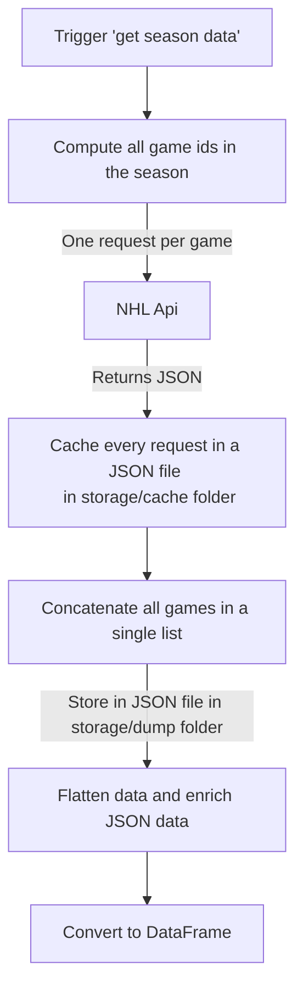

# Data

This package is responsible for fetching and storing the data from the NHL API.

## Storage

It uses the `ApiClient` class to fetch the data and the `FileSystemCache` class to store it.

It stores two types of data: the **cache** and the **dump**.

During the fetching of data, the cache is used to store the data temporarily.
This allows to run the fetching process in multiple steps without having to fetch the same data multiple times.
Cache is stored in the `ift6758/data/storage/cache` folder.
This can be changed with the `CACHE_PATH` environment variable.

Once the data of a season is fetched, it is stored in the dump.
At the end of the fetching process, you may want to clear the cache to free some space.
Dump is stored in the `ift6758/data/storage/dump` folder.
This can be changed with the `DUMP_PATH` environment variable.

## Data acquisition pipeline



## Examples

### Basic usage

#### Fetch data

```python
from ift6758.data import fetch_all_seasons_games_data

fetch_all_seasons_games_data()
```

This will fetch all the games from the NHL API and store them in `ift6758/data/storage/dump`.

#### Cache

If you need to free some space, you may need to clear the cache:

```python
from ift6758.data import clear_cache

clear_cache()
```

You can also delete the folder `ift6758/data/storage/cache`.

#### Load raw data

This will load the data from the dump.
Function `fetch_all_seasons_games_data` must have been called before.


```python
from ift6758.data import load_raw_games_data

data_2020 = load_raw_games_data(2020)
all_data = load_raw_games_data()
```

#### Load flattened data in a list of records

This will load the data from the dump and flatten it in a list of records.

```python
from ift6758.data import load_events_records

df_2020 = load_events_records(2020)
df_all = load_events_records()
```

#### Load flattened data in a DataFrame

This will load the data from the dump and flatten it in a DataFrame.

```python
from ift6758.data import load_events_dataframe

df_2020 = load_events_dataframe(2020)
df_all = load_events_dataframe()
```

### Advanced usage

```python
from ift6758.data import (ApiClient, FileSystemCache, DataTransformer, GameType)
import os
import json

cache_path = os.path.dirname(os.path.abspath(__file__)) + "/storage/cache"
cache = FileSystemCache(cache_path)

dump_path = os.path.dirname(os.path.abspath(__file__)) + "/storage/dump"
dump = FileSystemCache(dump_path)

client = ApiClient(cache)

data_transformer = DataTransformer()

data = client.get_games_data(2020, [GameType.REGULAR, GameType.PLAYOFF])
dump.set("2020", json.dumps(data, indent=2))

df = data_transformer.flatten_raw_data_as_dataframe(data)
records = data_transformer.flatten_raw_data_as_records(data)
```
